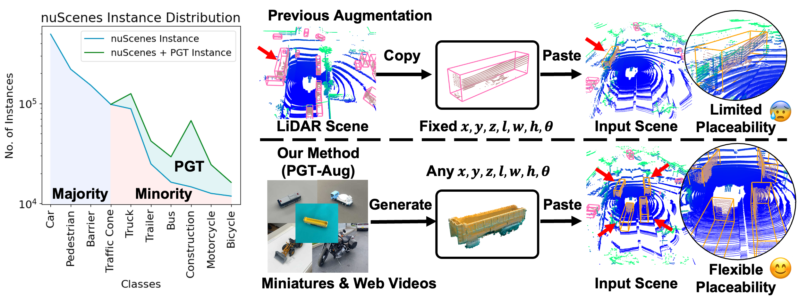
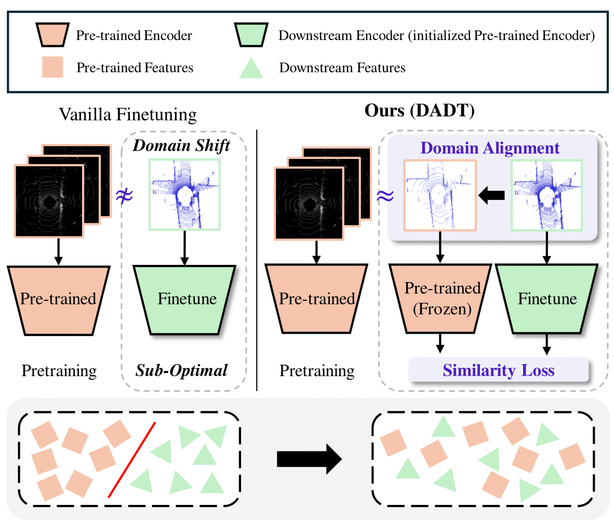
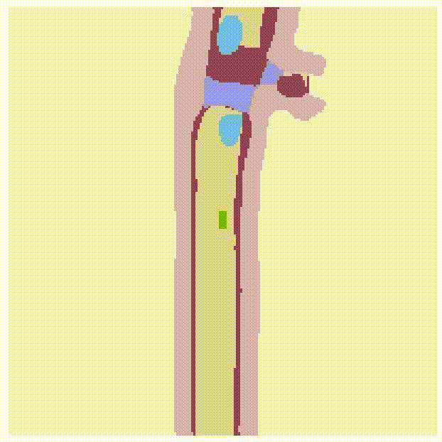

About Me
======
I am **Mincheol Chang**. I received my master degree at Department of Computer Science at **Korea University** under supervision of Professor Jinkyu Kim.   
My primary interest lies in developing real-world applications using computer vision and deep learning. 
My research interests are **3D Object Detection in Autonomous Driving, 3D reconstruction, Domain Generalization, Data Augmentation and Anomaly Detection**.

Education
====
* Korea University, Seoul, Korea 
  * MS in Artificial Intelligence 
  * Sep. 2022 - Aug. 2024

* Hong Kong University of Science and Technology
  * BS in Electronics and Computer Engineering
  * Sep. 2016 - Jun. 2022

Work Experience
======

* Visioin AI Lab, Seoul, Korea 
  * Full-time Graduate (Advisor: <a href="https://visionai.korea.ac.kr/">Prof. Jinkyu Kim</a>)
  * Sep. 2022 - Aug. 2024  
  * Researched on DL-based 3D Object Detection in Autonomous Driving, Anomaly Detection 

* NAVER LABS, Seongnam, Korea 
  * Research Intern (Advisor: <a href="https://scholar.google.com/citations?user=iGSaIU0AAAAJ&hl=en&oi=sra">Siyeong Lee</a>, <a href="https://scholar.google.com/citations?user=IYyLBQYAAAAJ&hl=en&oi=sra">Namil Kim</a>)
  * Mar. 2023 - Sep. 2023  
  * Researched on developing low-cost Pseudo LiDAR generation pipeline of long-tail classes using NeRFs

* Medical AI and Computer Vision Group, Hong Kong 
  * Research Intern (Advisor: <a href="https://xmengli.github.io/">Prof. Xiaomeng Li</a>)
  * Apr. 2021 - May. 2022  
  * Researched on Fourier Augmentation to develop domain generalizable segmentation model in Fundus data. 

* Upenn Solution, Seoul, Korea 
  * Crawler Developer Intern 
  * Jun. 2021 - Aug. 2021  
  * Developed web-scraping module for crawling data from NAVER News/Blog, Coupang, etc. 

Publications
======
> <i style='font-style: normal;'>**Just Add $100 More: Augmenting Pseudo-LiDAR Point Cloud for Resolving Class-imbalance Problem** </i>
>> <i style='font-style: normal;'>**Mincheol Chang**, Siyeong Lee, Jinkyu Kim, Namil Kim </i>
>> <i style='font-style: normal;'>Neural Information Processing Systems (**NeurIPS**), 2024. </i>
>> <i style='font-style: normal;'><a href="https://openreview.net/pdf/1811098cec4bd9ae87fb5f0de9ad844cef9e6f81.pdf">[Paper]</a>

<!--  -->

> <i style='font-style: normal;'>**Finetuning Pre-trained Model with Limited Data for 3D Object Detection by Bridging Domain Gaps** </i>
>> <i style='font-style: normal;'>Jiyun Jang, **Mincheol Chang**, Jinkyu Kim </i>
>> <i style='font-style: normal;'>IEEE/RSJ International Conference on Intelligent Robots and Systems (**IROS**), 2024. </i>
>> <i style='font-style: normal;'><a href="https://arxiv.org/abs/2410.01319">[Paper]</a>

<!--  -->

> <i style='font-style: normal;'>**BEVMap - Map-Aware BEV Modeling for 3D Perception** </i>
>> <i style='font-style: normal;'>**Mincheol Chang**, Seokha Moon, Reza Mahjourian, Jinkyu Kim </i>
>> <i style='font-style: normal;'>IEEE/CVF Winter Conference on Applications of Computer Vision (**WACV**), 2024. </i>
>> <i style='font-style: normal;'><a href="https://openaccess.thecvf.com/content/WACV2024/papers/Chang_BEVMap_Map-Aware_BEV_Modeling_for_3D_Perception_WACV_2024_paper.pdf">[Paper]</a><a href="https://github.com/mincheoree/BEVMap">[Code]</a><a href="https://www.youtube.com/watch?v=PLeWBx-J58Q">[Video]</a>

  
  
  

Projects
======
* Domain Generalizable Anomaly Detection 모델 개발
  * SK-Telecom 산학 프로젝트
  * Sep. 2022 - Feb. 2023 

* Domain Generalizable LiDAR 객체인식 Finetuning Method 개발
  * 현대자동차 산학 프로젝트
  * Sep. 2023 - Jun. 2024

* Mask 불량 검출 이상점 검출 기술 개발
  * 삼성전자 반도체 연구소 산학 프로젝트
  * Feb. 2024 - Jul. 2024
   
Awards
======
* 미래형자동차 핵심기술 R&D 산학프로젝트 성과 발표회 우수상 
  * 지도 정보를 융합한 멀티뷰 카메라 객체인식 모델 개발
  * Jan. 2024

Skills
======
* Python
* Pytorch/Tensorflow
* C++  
* Linux and Shell 
* Git and Docker
